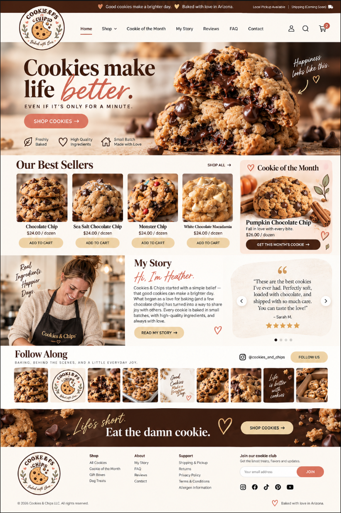

# Customer brand and design library

Updated September 19, 2026. These supplied originals are stored unchanged, with web-friendly filenames for the PNGs.

- [Brand & UI System V1 (PDF)](Cookies_and_Chips_Brand_UI_System_V1.pdf)
- [Website and social logo package V1](logo-package/README.md)
- [Download logo package ZIP](cookies-and-chips-logo-package-v1.zip)
- [Current circular logo (PNG)](cookies-and-chips-logo.png)
- [Updated homepage production rendition (PNG)](homepage-production-reference-2026-09-19.png)
- [All project documents](../README.md)

## Governing sources

The owner's September 19 instruction establishes the updated rendition as the overall look/layout/UX reference and the supplied guide as the source of exact colors and typography. This rendition supersedes `CC Wesite Mockup.png`. The circular logo replaces the earlier pending-logo assumption; use the supplied artwork intact and keep it replaceable.

The PDF is retained as supplied, including its CUSTOMER APPROVAL DRAFT labels. Do not silently rewrite the original. The owner's instruction now establishes its specified colors and font choices as the working source; places where it still says “or,” “approximately,” gives a range, or offers alternatives need a concrete implementation decision. The guide's page 22 description of general visual direction does not override the owner's production-rendition instruction.

Business rules and actual catalog data take precedence over illustrative screenshot prices, product names and content. Admin uses the separately requested light enterprise layout. This library does not authorize unrelated project access or application implementation before the build contract is ready.

## Guide values transcribed for implementation planning

| Token | Exact value |
| --- | --- |
| Chocolate | #4A2A1D |
| Cocoa | #6A3A28 |
| Warm Cream | #F7E8CF |
| Paper | #FFF9F0 |
| Caramel | #C99155 |
| Golden Crumb | #E5B56B |
| Coral Accent | #E87863 |
| Blush | #E79A9D |
| Leaf | #6F8055 |
| Ink | #2A201B |

Typography: DM Serif Display 400 for display/headings; Inter 400/500/600/700 for body/UI. The guide proposes Allura or equivalent for accents; Allura is the named candidate, but the guide does not uniquely fix the script choice. No arbitrary substitution. Verify font assets/licenses before shipping.

| Style | Desktop size/line height | Mobile size/line height |
| --- | --- | --- |
| Hero | 48/52px | 40/44px |
| H1 | 38/44px | 32/38px |
| H2 | 30/36px | 26/32px |
| H3 | 22/28px | 20/26px |
| Body L | 18/28px | 17/26px |
| Body | 16/24px | 16/24px |
| Small | 14/20px | 14/20px |
| Meta | 12/16px | 12/16px |
| Button | 14/16px | 14/16px |

Spacing scale: 4, 8, 12, 16, 24, 32, 48, 64, 96px. Guide ranges still to resolve: 1200–1280px content width, 8–12px card radius, 5–8px button/input radius, and product-card 4:5 versus 1:1 crops. The rendition's rounded CTA treatment needs an explicit role/preset mapping against the guide. State colors and accessible foreground/background pairings must be defined rather than invented from descriptive names.

Logo usage: preserve proportions/artwork, at least 12% diameter clear space, minimum 72px for the full circular mark per guide. Supporting horizontal, favicon and social derivatives are now supplied in the V1 logo package for review. Do not reconstruct the original artwork in code.
